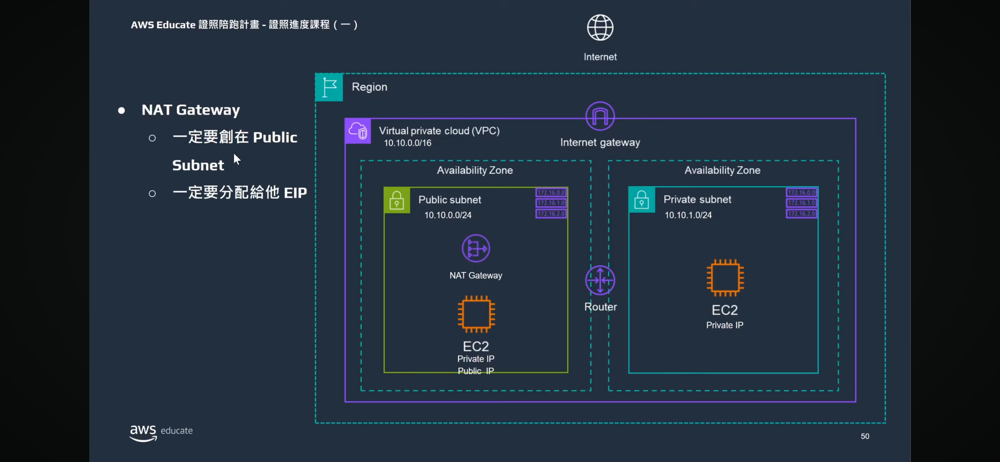
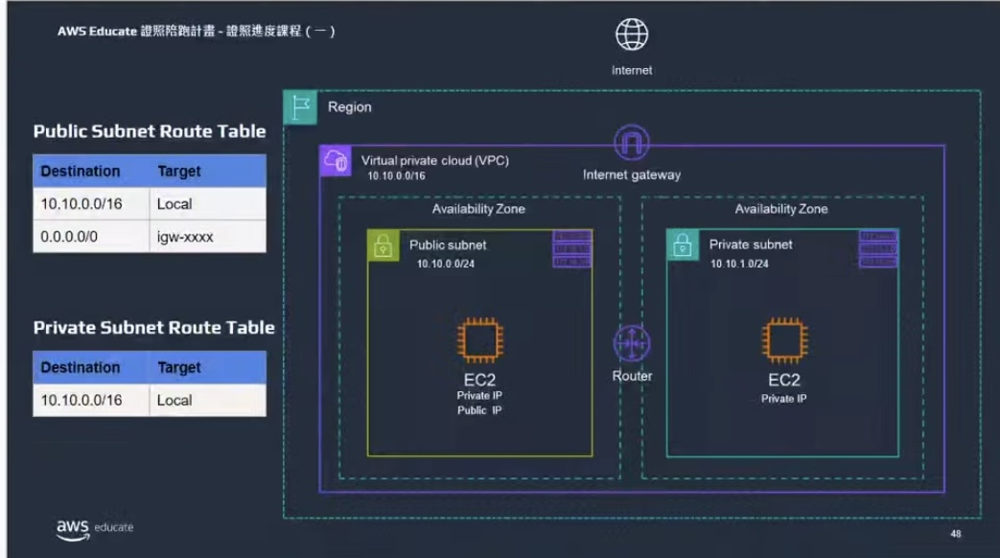
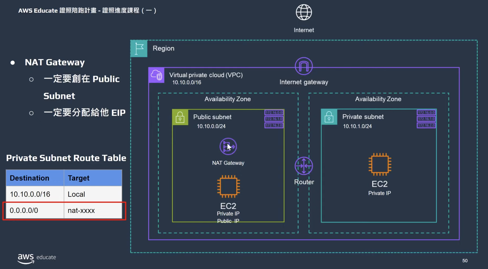

# Networking
## AWS 的連線能力

### Amazon Virtual Private Cloud (Amazon VPC)
- 在 AWS 資源周邊建立界限，佈建 AWS 雲端的分隔區段
- 自己定義的虛擬網路中啟動資源，將資源組織成子網路。
- VPC 內流量互通
  - 可以用私有 IP 互連，即便是私有子網還是公有子網(前提是你路由表沒有亂設)

### Internet Gateway
- 允許來自網際網路的公有流量存取 VPC
### NAT Gateway
- 只能放在 public subnet

### route table
route table 服務預設會有 local，也就是圖片裡的 router；若把 local router 拿掉，子網之間就無法互連線。

若要讓私有子網裡的 instace 也可以接受到網路上的資源，可以讓私有子網的 route table 連到 NAT gateway，再讓 NAT gateway 連到 public subnet 的路由表，最後透過public subnet 的路由表連到 internet gateway

### Virtual private gateway
- 存取 VPC 中的私有資源
- 在 VPC 和私人網路 (例如內部部署資料中心或企業內部網路) 之間建立虛擬私人網路 (VPN) 連線。流量必須來自核准的網路，虛擬私有閘道才會允許流量進入 VPC。
- 雖然此連線為私有且經過加密，但是會流經公有網際網路，而不是經由專用連線。

### AWS Direct Connect
- 在資料中心和 VPC 之間建立專用私有連線

## Subnets and Network Access Control Lists
將咖啡店的櫃檯區域視為 VPC。櫃檯區分成兩個不同的區域，一個是收銀員的工作站，一個是咖啡師的工作站。在 VPC 中，子網路是用來將資源各自分組的個別區域，透過控制網路流量，限制使用者的存取。

### subnet
- 子網路是 VPC 的一個區段，可以根據安全性或操作需求將資源分組到區段中。
- 子網路可以設為公有或私有，區分方式不一定是用公有IP，而是用 Internet gateway。
- 範例
  - 

### Network traffic in a VPC
- 封包是透過網際網路或網路傳送的資料單位，客戶向 AWS 雲端中託管的應用程式請求資料時，此請求會以封包形式傳送。
- 封包進入子網路或離開子網路之前會先被檢查權限。這些權限代表著封包由誰傳送，以及在子網路中嘗試與資源通訊的方式。
- 檢查封包的子網路權限的 VPC 元件是網路存取控制清單 (ACL)。

### Network ACLs
- 虛擬防火牆
- 每個 AWS 帳戶都包含一個預設網路 ACL
- 預設網路 ACL 會允許所有傳入和傳出流量
- Stateless packet filtering / **無狀態**封包篩選
  - 網路 ACL 會執行無狀態封包篩選，忽略所有規則，一律檢查往來跨越子網路邊界的傳入和傳出封包。**無狀態是指流量進出無關連**
  - 封包進入子網路後，必須接受權限評估，確認是否能存取子網路內的資源 (例如 Amazon EC2 執行個體)。 
  - 

### security group 
- 虛擬防火牆，可控制 Amazon EC2 執行個體的傳入和傳出流量。
- 預設情況下，安全群組會拒絕所有傳入流量，並允許所有傳出流量。
- State packet filtering / **狀態封包篩選**
  - 執行有狀態封包篩選。**有狀態是指，進得去就出的來；反之出不來，兩者有關**
  - 當該請求的封包回應傳回執行個體時，安全群組會記住先前的請求。無論傳入安全群組規則為何，安全群組都會允許回應繼續執行。
  - 

## 全球網路
### 網域名稱系統 (DNS)
- 使客戶在瀏覽器中輸入網址，即可存取網站
- DNS 解析是將網域名稱轉譯為 IP 位址的過程
- 
### Amazon Route 53
-  DNS Web 服務
-  將最終使用者路由到 AWS 託管的網際網路應用程式、AWS 中執行的基礎設施
-  管理網域名稱的 DNS 紀錄，可以直接在 Route 53 中註冊新的網域名稱
-  範例
   - 
   - Amazon Route 53 使用 DNS 解析來識別 AnyCompany.com 的相應 IP 地址 192.0.2.0。這個資訊會再傳回給客戶。
   - 客戶的請求會透過 Amazon CloudFront 傳送到最近的節點。
   - Amazon CloudFront 會連接到 Application Load Balancer，後者會將傳入的封包傳送到 Amazon EC2 執行個體。

