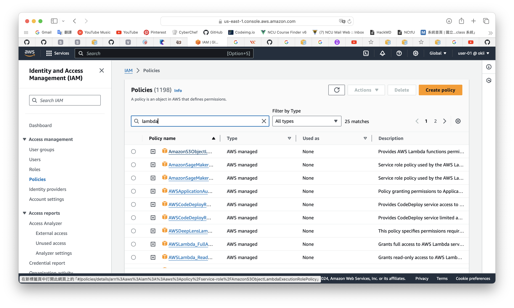
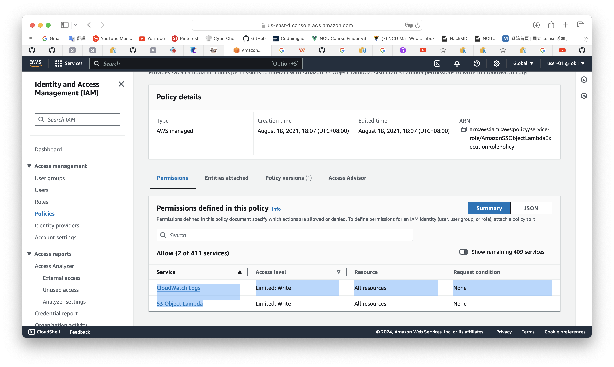

# IAM policy
This is the detail from an example policy called "AmazonS3ObjectLambdaExecutionRolePolicy."



This policy have 2 permissions.



Turn the information to JSON file.
```json
{
    "Version": "2012-10-17",
    "Statement": [
        {
            "Effect": "Allow",
            "Action": [
                "logs:CreateLogGroup",
                "logs:CreateLogStream",
                "logs:PutLogEvents",
                "s3-object-lambda:WriteGetObjectResponse"
            ],
            "Resource": "*"
        }
    ]
}
```

From the [official document](https://docs.aws.amazon.com/IAM/latest/UserGuide/access_policies.html), we can know that:
- effect: allow or deny this policy.
- action: a list of actions that the policy allows or denies.
- resource: a list of resources which these action will apply to.
- statement
  - to describe details about policy.
  - can have multiple statements in a policy.