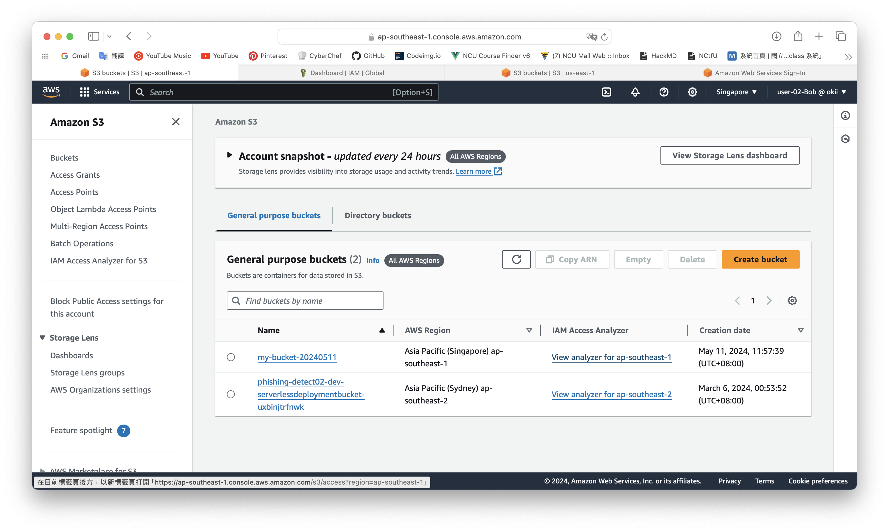
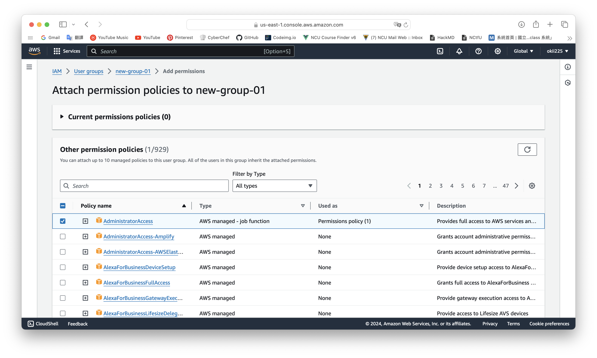

# IMA-share-resources
Actually, all the IAM users are based on the root account So others who have same permissions can find changes after one changes things in the cloud.

## screenshots
Bob created a S3 bucket.

Other users can see it.

