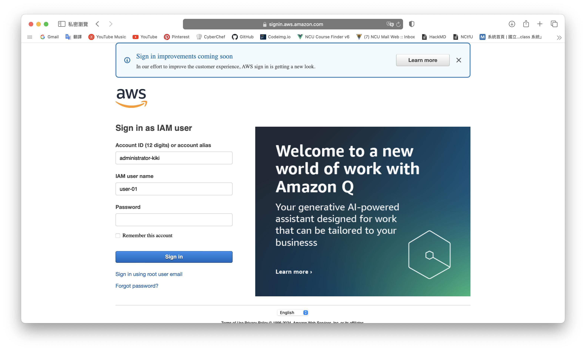

# set alias
## what is alias
You can think of it as a nickname for your IAM resources. It can let your IAM resources be managed easily. For example, you can call your IAM user Alice, Bob, Charlie, Daniel... 

With the link generated after setting the alias, you can get in IAM user console with a simple user name. 

