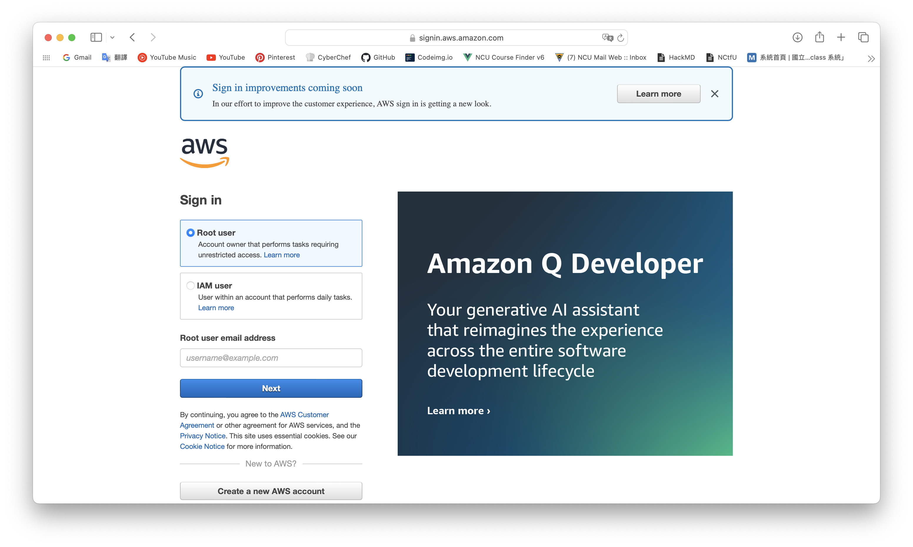
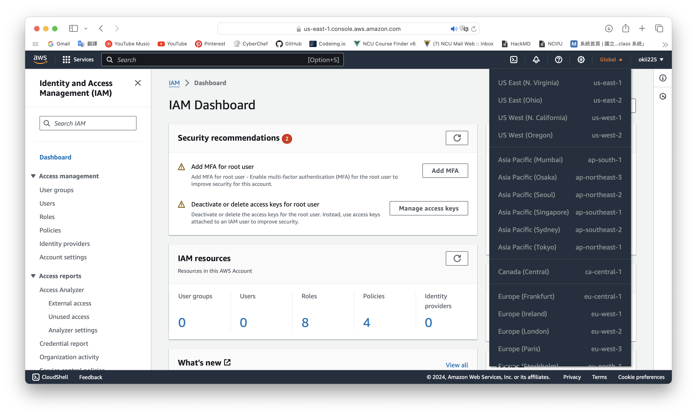
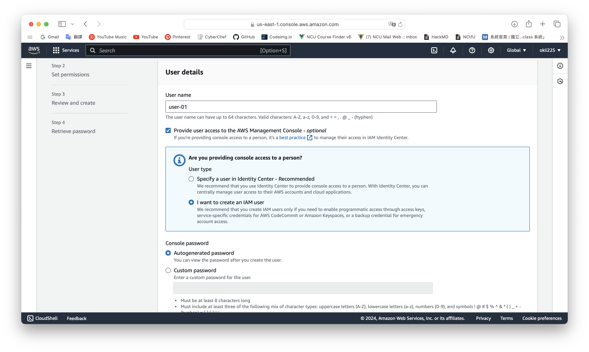
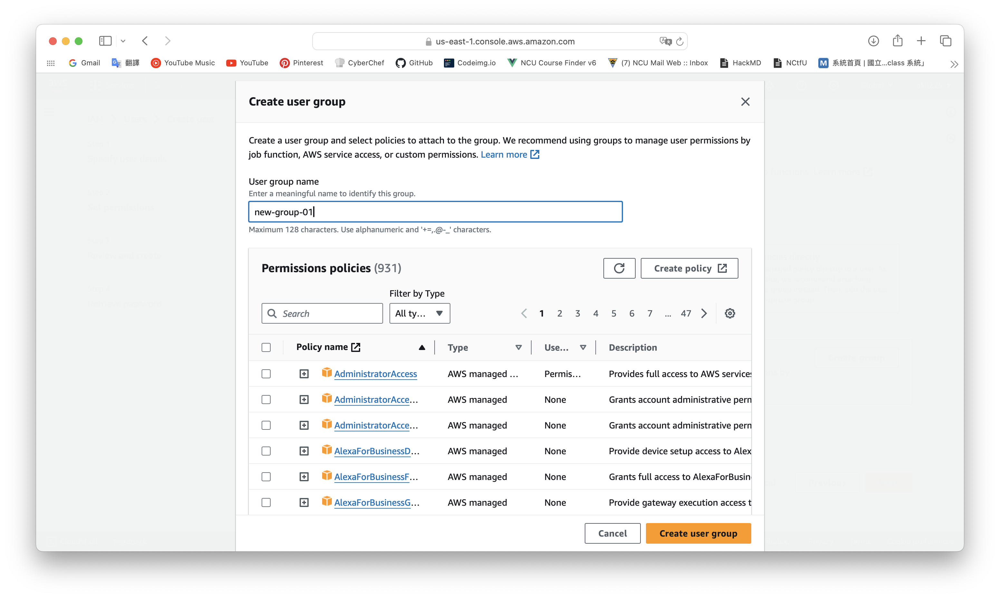

# set-an-iam-user
Before we start this practice, let's talk about IAM. Actually, every AWS user is an IAM user, this identity also called "root" and it is set by default.

From the login page, if you do not set the IAM user, you have to sign in as a root user. Then we can get access to the resources which the policy agree us to use.

## steps
Go to the IAM dashboard, the region list show that we are in the global region when setting IAM resources. So, we can know that IAM is not a regional service.

Go to "users" in the left-hand-side list to create an IAM user.

You can decide whether to choose a group to manage your users. Then we can add policies to attach to the groups or users. Permissions are defined by policies.

If you want your IAM user can act as the root user, you can add "AdministratorAccess" policy to the IAM group.