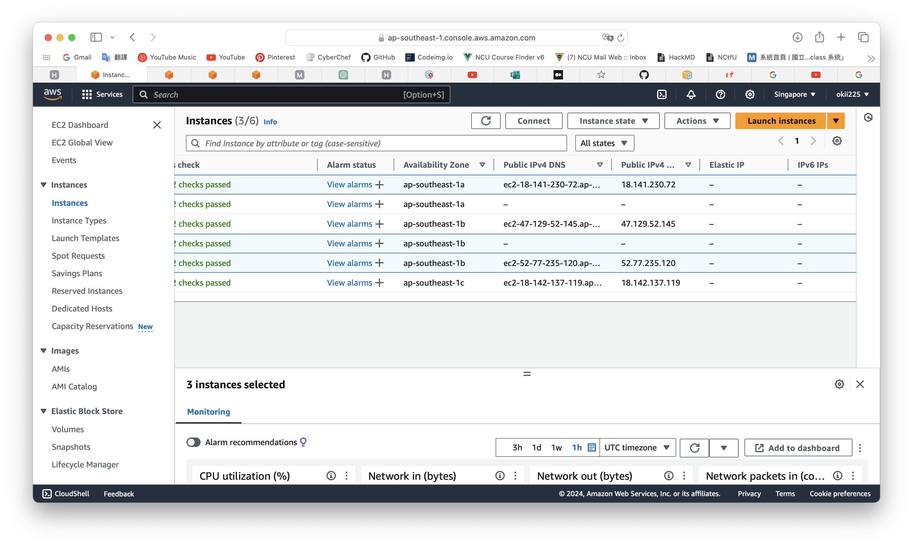

# 2 Available Zone subnets connection
## Learning goal
For knowing the concept of networking and how to use the common services, such as ec2, vpc, etc.
## Concept
### VPC (Virtual Private Cloud)
AWS VPC is an isolated piece of the cloud. You control who gets to visit and who stays out, ensuring your resources are secure and organized with AWS VPC. 
### Subnet
A subnet is a range of IP addresses in your VPC. In AWS, we can build public subnets and private subnets to control the access to the Internet. 

A **public subnet means the subnet has a direct route to an internet gateway.** Resources in a public subnet can access the public internet. On the other side, a private subnet represents the subnet does not have a direct route to an internet gateway. It is usually used to put important resources so it cannot expose to the Internet. Resources in a private subnet require a NAT device to access the public internet.

### Gateway
- Internet Gateway: Allow communication between the resources in your VPC and the internet.
- Network Address Translation / NAT Gateway: This is the secret passage for your private resources to access the internet without exposing themselves. A  NAT Gateway allows instances in private subnets to connect to the internet. **It's important that NAT gateway is set in the public subnet.**
### Route table
Has a route between VPC and gateway. It have a route call "local" by default for all traffic connect in a whole VPC. The "local" route I use "router" to present in the diagram.

## Architecture diagram


## Steps
### Create the VPC


### Create the Subnet
At first, we set that the following subnets will be created in which VPC.


Then create the subnets you need. Here I create 4 subnets in two regions.


### Create the Route Table
We use the route tables to tell each subnet how to communicate. We will use 2 route tables later, because we have subnets for public and private. We create a route table for private first.


### Edit Subnet's Association
One route table for public subnet and another for provate. We select two private subnets to associate with the route table we just created.


These two selected route tables are for the VPC we just created. The one which name us "-" is the Main route table set by default.


### Create Internet Gateway
The Internet Gateway lets VPC connect to the Internet.


After creating the Internet Gateway, we can add route to the route table. This step will let the instances in the subnets can communicate with the Internet.


### Create NAT Gateway


Let private subnets have access to the Internet. Add new route to the route table like the screenshot below.


### Create Security Group
Create a security group for the VPC you created.


Because of practicing, we just allow all traffic to any destination or from any destination.


### Create EC2
Create EC2s for each subnet for checking the traffic status.


Choose the security group we have created or create a new one(remember to edit setting later).


## Check for connection between two public subnets
We connect to the EC2 in public-1a subnet. You can do the test in your local terminal by the following SSH command.
```
ssh -i <YOUR_LOCAL_PATH_TO_KEY> ec2-user@<EC2_PUBLIC_IPV4_DNS>
```
Then you will see:
```
[ec2-user@ip-10-0-1-253 ~]$
```
10.0.1.253 is private ip for public-1a EC2. We use public-1a host to ping to public-1b EC2.
```
ping <EC2_PUBLIC-1b_PRIVATE_IP> 
```
If the packets transmitted successfully, the network setting for two public subnet is correct.
## Problem & Fix
### No public IP
The [AWS document](https://docs.aws.amazon.com/AWSEC2/latest/UserGuide/using-instance-addressing.html#concepts-public-addresses) says that they don't assign a public IP address to instances launched in a nondefault subnet, so we have to fix it by editting subnet settings. 

Select "Enable auto-assign public IPv4 address"


Now both of the EC2s (public-1a & public-1b) have their public IP addr. (The EC2s I select are public-1a, private-1b and public-1b respectively.)


However, you can find that we do not have public IPv4 DNS. The solution I will talk in the following part.

### No dns
Go to your VPC > EditVPC settings > click "Enable DNS hostnames"


Then the DNS will show.  (The EC2s I select are public-1a, private-1b and public-1b respectively.)




### EC2 cannot ping to each other 
The following problem happens when your EC2 cannot transmit/receive the packets successfully.


This problem is due to the setting of security group. Therefore, we edit the "Inbound rules" and "Outbound rules" for allowing more traffic to come.


It works.


## Conclusion
In this practice, I learn the concepts of how the network works in AWS cloud. With distinguishing private and public subnet, I can control how user can access the thing running in that IP or not. Then, I use two kinds of gateways to allow subnets connect to the Internet. By doing this, the instances in each of the subnet can do things such as upgrading with the commands.

Later, I will learn the security part in AWS cloud architecture.