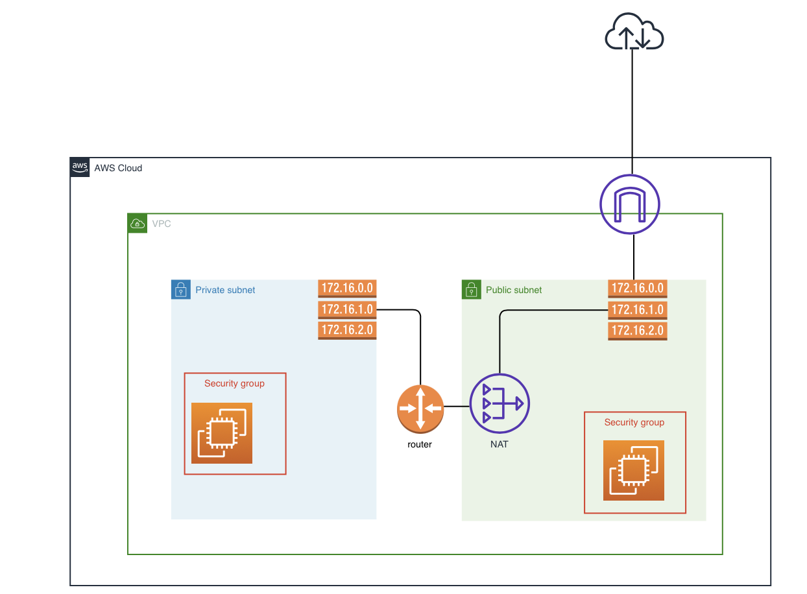
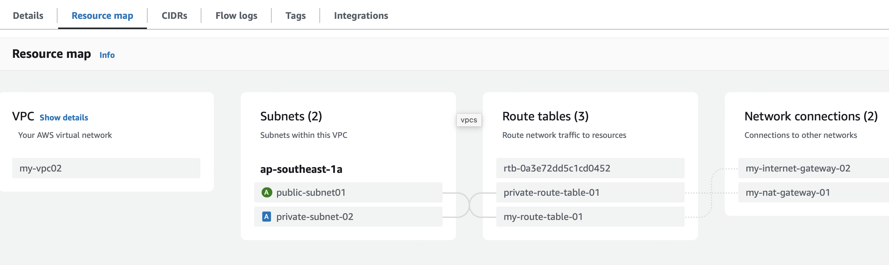
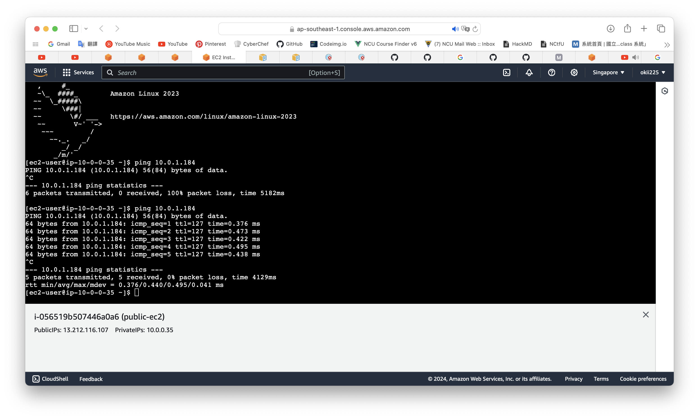

# Network Connection between Public Subnet and Private Subnet 
## Learning goal
To understand the network connection between public subnet and private subnet in the same VPC.
## VPC Architecture Diagram

## Details
Build a VPC and create 2 subnets into it. For each subnet, we create an EC2 instance for it to test the network connection. We also create a route table for each EC2 instance for connecting to the gateway, so that the instance can get resources from the Internet.

We can see how the route table and gateway connect in the VPC from the resource map.

For the public subnet, it is associated with the route table "my-route-table-01." This route table has a route to "my-internet-gateway-02," which lets the subnet connect to the Internet directly.

For the private subnet, it is associated with the route table "private-route-table-01." This route table has a route to "my-nat-gateway-01," which lets the subnet connect to the public subnet, not the Internet directly. To prove the connection is successful, I use the EC2s instance to ping.

For public-ec2, the PrivateIPs is `10.0.0.35`. For private-ec2, the PrivateIPs is `10.0.1.184`. After connecting to the public-ec2 instance, we ping to private-ec2 with the private IP. The result shows the connection is correct.

You might wondering the third route table named "rtb-xxxxx...." was created for what. Actually it will be created by default when the VPC is created. It is also called "main route table" because it associate to all the subnets first.

## Conclusion
This is my first practice for VPC network connection. I learned the entry level concept of many resources, including the gateways, VPCs, subnets, and so on. For advancing skills, I still have to do more practices.

By the way, I think I should do better for naming the resources I need in the coming practices.
