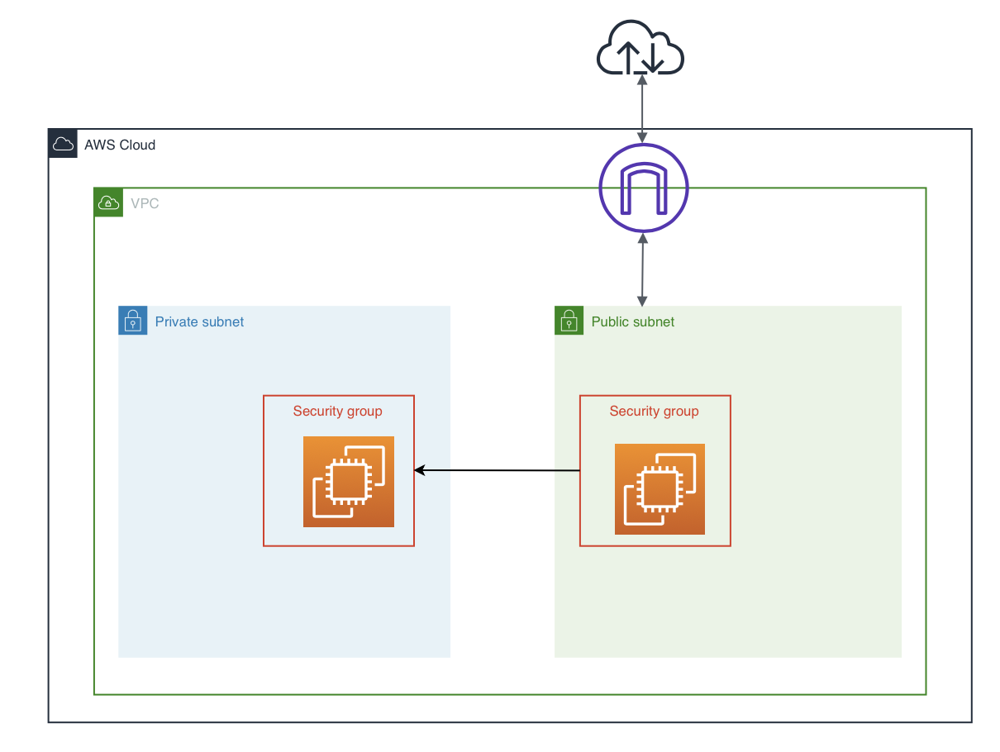
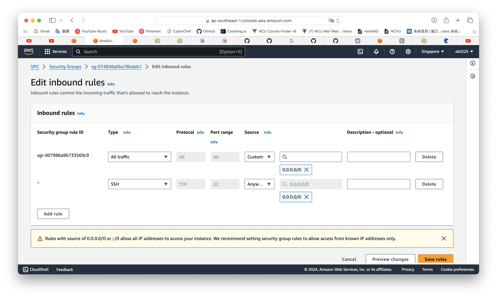
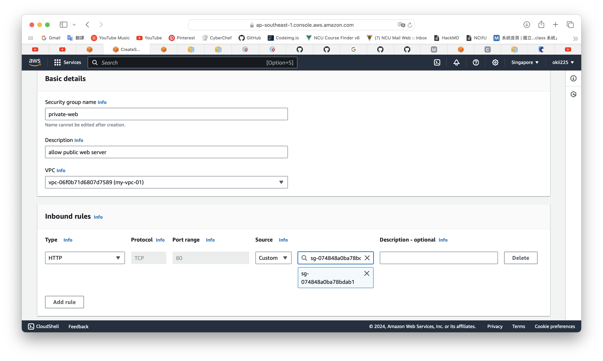

# Security Group to Security Group
## What is Security Group(SG)
A security group controls the traffic that is allowed to reach and leave the resources that it is associated with. For example, after you associate a security group with an EC2 instance, it controls the inbound and outbound traffic for the instance. It is also called virtual firewall.

## Learning goal
To learn how to build a simple connection between public web server and a private app with two security groups.

## Architecture diagram

## Implementation
We create a private subnet and a public subnet in a VPC first. Then build 2 EC2s in the subnets, and each of them has one EC2. The third step is to create a public-secouruty-group which will be associated to EC2 in pub-subnet, and create a private-secouruty-group for another subnet.

The detail setting about these two SGs will be described now.

### public SG
- propose: to be a web server that can connect to all requests.
- inbound rules / outbound rules: allow all traffic

If you set the first inbound rule as "allow all HTTP" instead of "allow all traffic," you need to add the second rule as the screenshot. That is because you must authorize port 22 for the EC2 Instance Connect service IP addresses in your Region for using EC2 Instance Connect.

### private SG
Here we delete all the outbound rules so that no detailed information will be sent to the Internet. Only add an Inbound rule that private-sg can link to public-sg.

## Conclusion
By doing these steps, we build a simple version of connection between web server (public sg) and user app (private sg).