# AWS Networking with VPC 
## What is VPC (Virtual Private Cloud)
AWS VPC is an isolated piece of the cloud. You control who gets to visit and who stays out, ensuring your resources are secure and organized with AWS VPC.

## Intro

- Subnets: Think of these as neighborhoods within your town. Public subnets face the main road (the internet), while private subnets are tucked away. A subnet is a range of IP addresses in your VPC.
- Internet Gateway: Allow communication between the resources in your VPC and the internet.
- NAT Gateway: This is the secret passage for your private houses (resources) to access the internet without exposing themselves. A Network Address Translation (NAT) Gateway allows instances in private subnets to connect to the internet.
- Route table: Has a route between  VPC and gateway. 

## Diagram
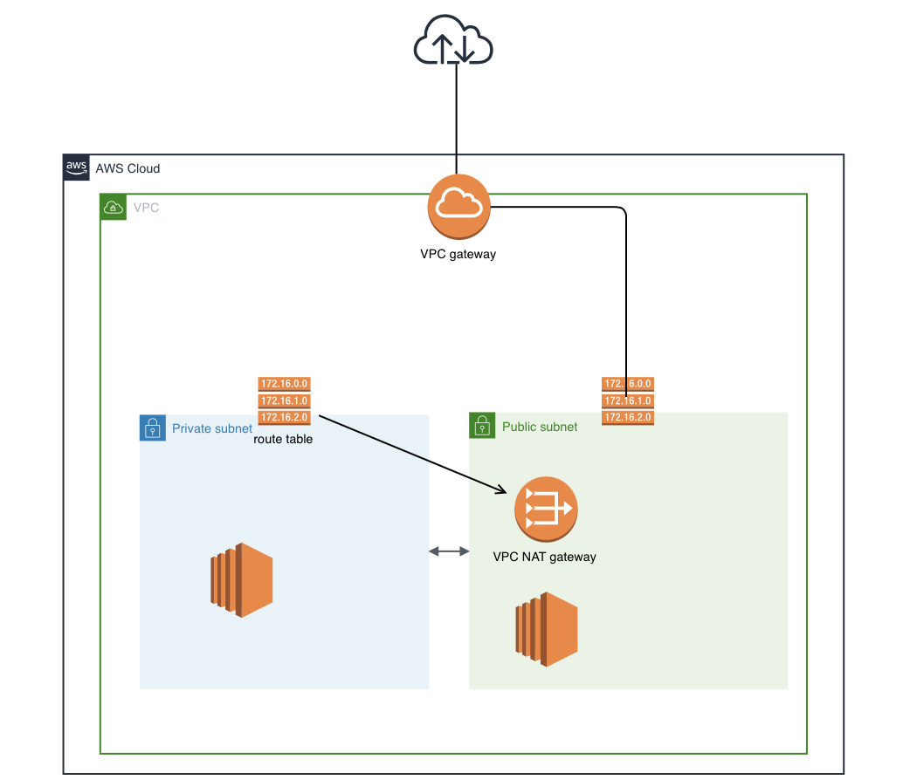

## Steps
### Create the VPC
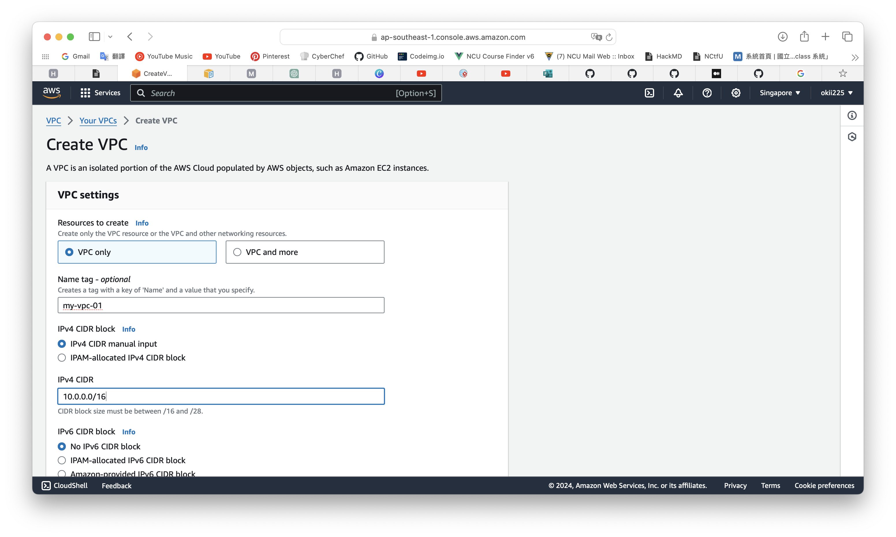

### Create the Subnet
At first, we set that the following subnets will be created in which VPC.

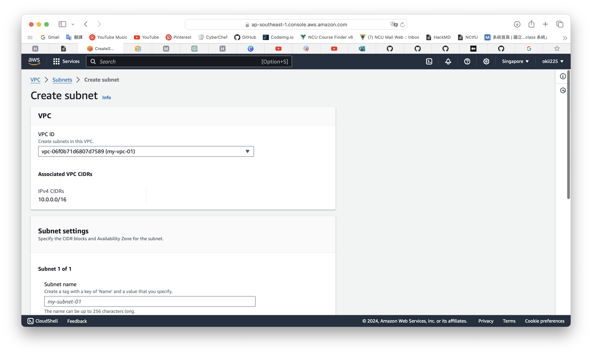

Then create the subnets you need. Here I create 4 subnets in two regions.

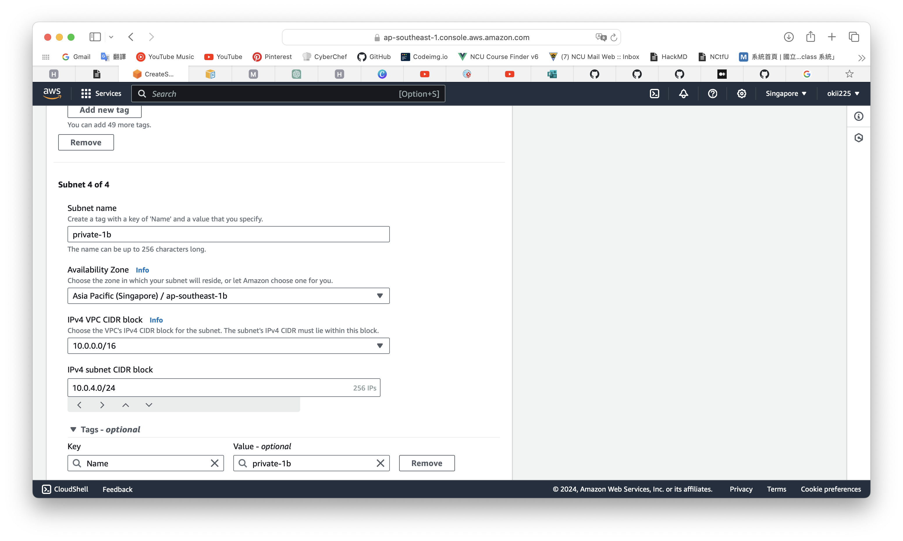

### Create the Route Table
We use the route tables to tell each subnet how to communicate. We will use 2 route tables later, because we have subnets for public and private. We create a route table for private first.

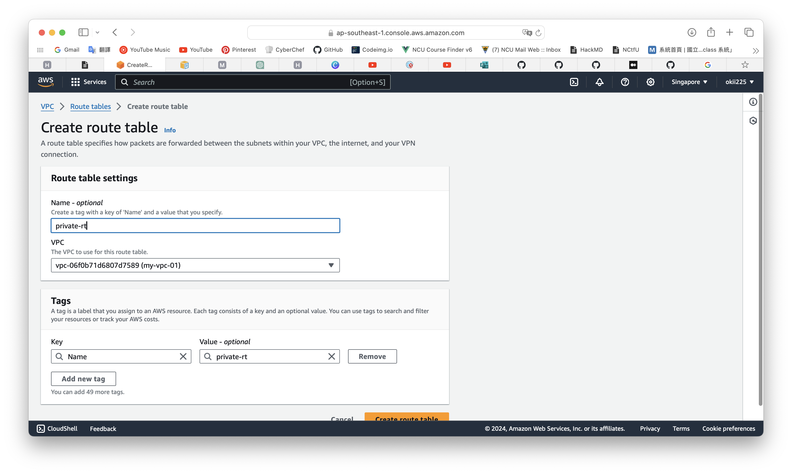

### Edit Subnet's Association
One route table for public subnet and another for provate. We select two private subnets to associate with the route table we just created.

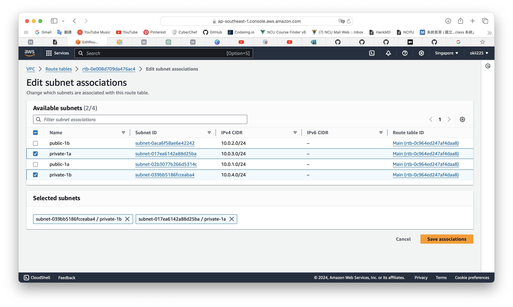

These two selected route tables are for the VPC we just created. The one which name us "-" is the Main route table set by default.

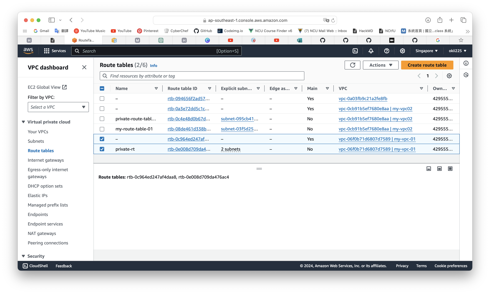

### Create Internet Gateway
The Internet Gateway lets VPC connect to the Internet.

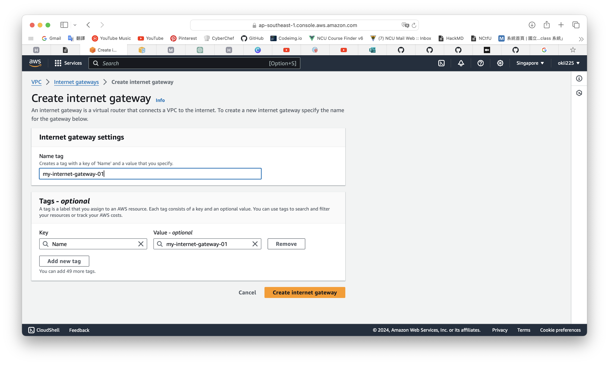
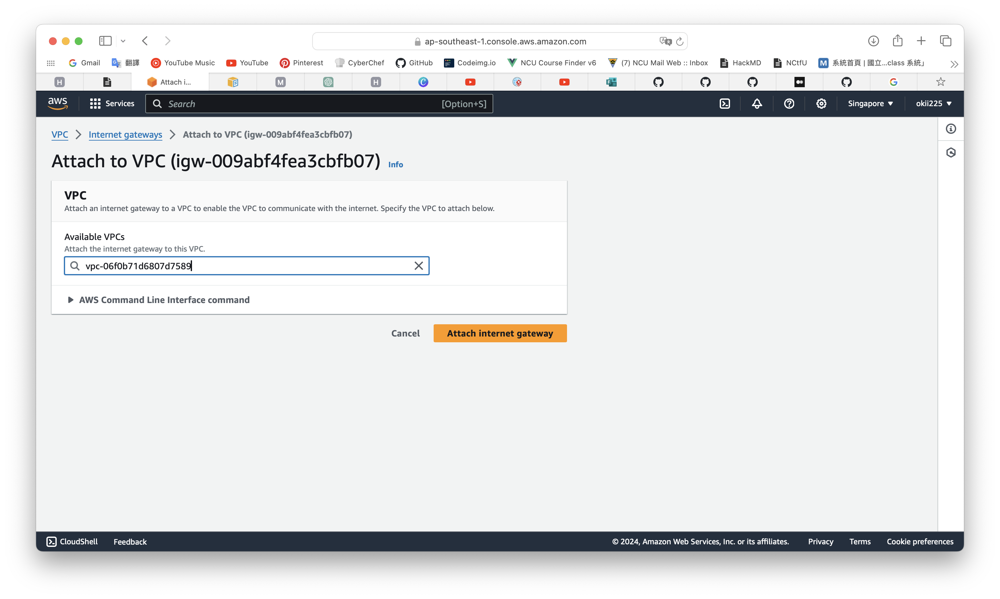

After creating the Internet Gateway, we can add route to the route table. This step will let the instances in the subnets can communicate with the Internet.

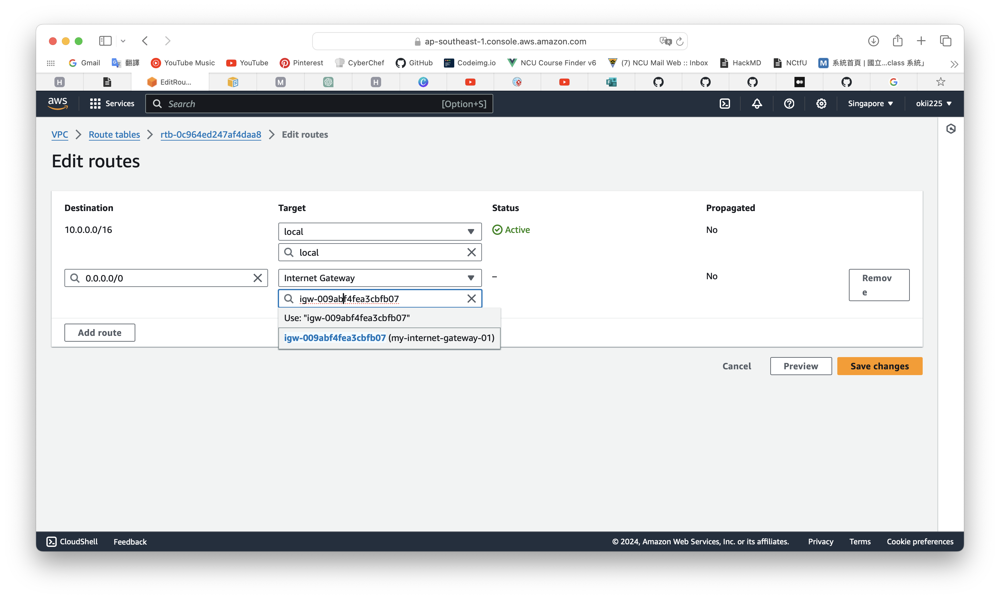

### Create NAT Gateway
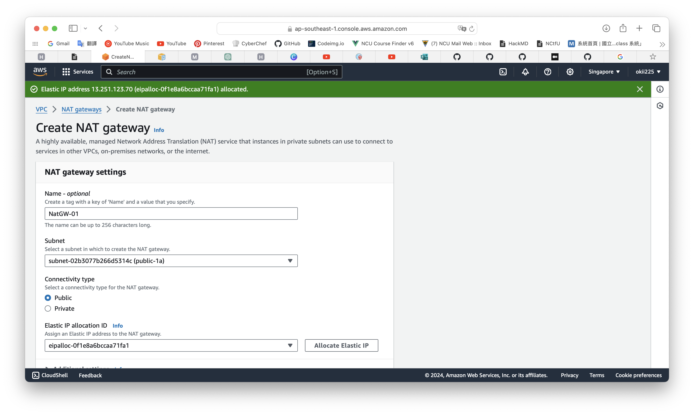

Let private subnets have access to the Internet. Add new route to the route table like the screenshot below.

### Create Security Group
Create a security group for the VPC you created.

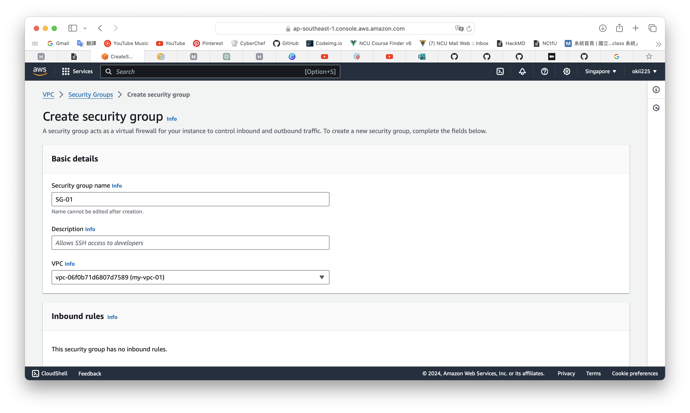

Because of practicing, we just allow all traffic to any destination or from any destination.

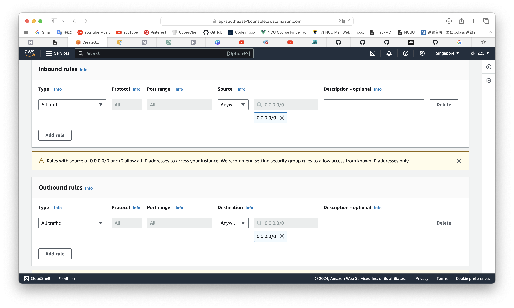

